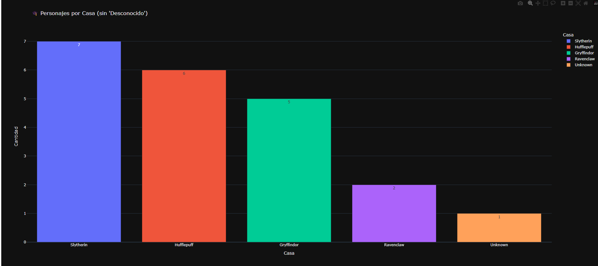
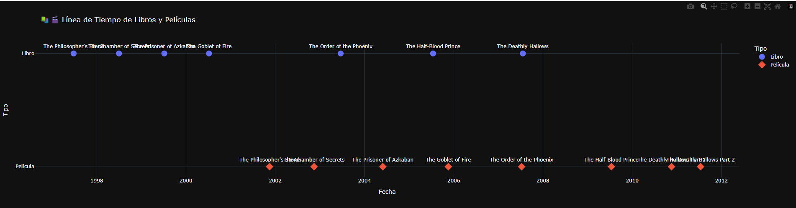
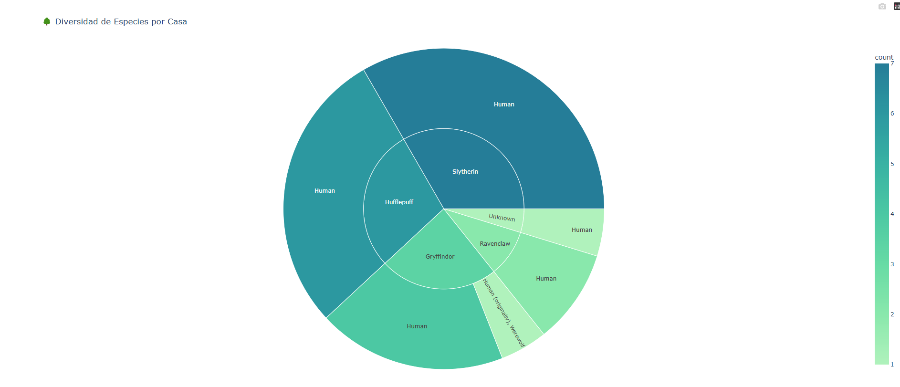

# Proyecto de Visualización de Datos de Harry Potter 🧙‍♂️

Este proyecto utiliza datos relacionados con el universo de Harry Potter para realizar análisis y visualizaciones interactivas. Los datos incluyen personajes, libros, películas y hechizos, y se procesan utilizando Python y bibliotecas como `pandas`, `plotly` y `ydata-profiling`.

## Estructura del Proyecto 📂

- **`main.py`**: Script principal que realiza la carga, limpieza, análisis y visualización de los datos.
- **Archivos CSV**:
  - `potter_characters.csv`: Información sobre los personajes.
  - `books.csv`: Detalles de los libros.
  - `movies.csv`: Detalles de las películas.
  - `hechizos.csv`: Información sobre los hechizos.

## Requisitos 🛠️

Asegúrate de tener instaladas las siguientes dependencias antes de ejecutar el proyecto:

- Python 3.8 o superior
- Bibliotecas de Python:
  - `pandas`
  - `plotly`
  - `ydata-profiling`

Puedes instalarlas ejecutando:

```bash
pip install pandas plotly ydata-profiling
```

## Cómo Ejecutar el Proyecto ▶️

1. Clona este repositorio en tu máquina local:

   ```bash
    git clone https://github.com/miguelASL/harry_potter
    cd harry_potter
   ```

2. Asegúrate de que los archivos CSV estén en la carpeta del proyecto.

3. Ejecuta el script principal:

   ```bash
    python main.py
   ```

4. Disfruta de las visualizaciones interactivas generadas.

## 📊 Visualización

El script genera varias visualizaciones interactivas:

- **🎓 Personajes por Casa:** Gráfico de barras que muestra la cantidad de personajes por casa.
- **⚖️ Género de Personajes:** Gráfico de pastel que muestra la distribución de género.
- **📚🎬 Línea de Tiempo de Libros y Películas:** Gráfico de dispersión que muestra las fechas de lanzamiento de libros y películas.
- **Distribución de Género por Casa:** Gráfico de barras apiladas que muestra la distribución de género en cada casa.
- **🌳 Diversidad de Especies por Casa:** Gráficos de treemap y sunburst que muestran la diversidad de especies en cada casa.

### Ejemplo de Visualizaciones 🌟

### Ejemplo de Visualizaciones 🌟

#### 🎓 Personajes por Casa


#### 📚🎬 Línea de Tiempo de Libros y Películas


#### 🌳 Diversidad de Especies por Casa


## 🤝 Contribuciones

¡Las contribuciones son bienvenidas! Por favor, sigue los siguientes pasos:

**1. Haz un fork del proyecto y crea una nueva rama:**
    
- ``` git checkout -b feature/nueva-funcionalidad ```

**2. Realiza tus cambios y haz commit:**
- ```git commit -am 'Agrega nueva funcionalidad'```

**3. Sube los cambios:**
- ```git push origin feature/nueva-funcionalidad```

**4. Abre un Pull Request.**

## 📜 Licencia

Este proyecto está licenciado bajo la Licencia MIT.

## 📬 Contacto

**Email**: [](mailto:msarmientolevy@gmail.com)

**LinkedIn**: [](https://www.linkedin.com/in/miguel-sarmiento-levy)

**Enlace del Proyecto**: [](https://github.com/miguelASL/harry_potter)